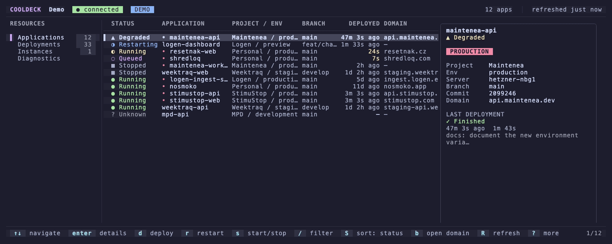

<div align="center">

# 🎛️ CoolDeck

**Vaše Coolify flotila na jedno stisknutí klávesy.**

Deploymenty, logy, restarty a přepínání instancí pro [Coolify](https://coolify.io) -
z terminálu, který stejně máte otevřený.

*Žádná záložka v prohlížeči. Žádný démon. Žádný token na obrazovce. Záměrně.*

<br>

[](https://github.com/Resetnak/cooldeck/actions/workflows/ci.yml)
[](https://github.com/Resetnak/cooldeck/actions/workflows/security.yml)
[](go.mod)
[](https://goreportcard.com/report/github.com/resetnak/cooldeck)
[](LICENSE)
[](.github/workflows/ci.yml)
[](docs/coolify-api.md)
[](https://github.com/Resetnak/cooldeck/releases/latest)
[](https://repometer.online/p/Resetnak/cooldeck)

<br>

[English](README.md) · **Čeština**

[Rychlý start](#-rychlý-start) · [Vlastnosti](#-hlavní-vlastnosti) · [Fleet tail](#-fleet-tail) · [MCP](#-vaše-flotila-ve-vašem-agentovi) · [Srovnání](#-srovnání) · [Klávesové zkratky](#-klávesové-zkratky) · [Instalace](#-instalace) · [Konfigurace](#-konfigurace) · [Bezpečnost](#-bezpečnost) · [Přispívání](CONTRIBUTING.md)

</div>

<div align="center">
  

  <sub>Jedna degradovaná aplikace od začátku do konce: <code>/</code> filtr, <code>enter</code> detail, <code>l</code> runtime logy, <code>d</code> redeploy s potvrzením, <code>2</code> <code>a</code> a je vidět v aktivní frontě. Vyrenderováno z <a href="cassette.tape">cassette.tape</a>.</sub>
</div>

**Celé UI vyzkoušíte jedním řádkem - bez instance Coolify, bez tokenu, bez sítě:**

```bash
# macOS (Homebrew)
brew install resetnak/tap/cooldeck && cooldeck --demo

# Linux a macOS (instalační skript)
curl -fsSL https://raw.githubusercontent.com/Resetnak/cooldeck/main/install.sh | sh && cooldeck --demo
```

Máte radši Go? `go install github.com/resetnak/cooldeck/cmd/cooldeck@latest`. Chcete binárku? Každé
[vydání](https://github.com/Resetnak/cooldeck/releases/latest) obsahuje archivy pro Linux, macOS
i Windows a k tomu `.deb`/`.rpm`/`.apk`. `--demo` běží na deterministických ukázkových datech - těch
samých, která renderují golden testy - takže si produkt osaháte dřív, než mu dáte token.

---

## 💡 Proč CoolDeck?

Ověřit, jestli deploy prošel, by nemělo stát záložku v prohlížeči, přihlášení a tři prokliky
dashboardem. **CoolDeck** dává stejnou flotilu - stavy, historii deploymentů, runtime logy i tlačítko
deploy - do terminálového okna, které si můžete nechat otevřené vedle editoru, a všechno ovládá
z klávesnice.

Mluví přímo s Coolify REST API. Žádná proxy, žádný agent, žádný daemon: jedna statická binárka, která
si přečte konfiguraci, vytáhne token z OS keyringu a vykreslí.

```text
 COOLDECK  Demo   ● connected   DEMO                              12 apps  |  refreshed just now
────────────────────────────────────────────────────────────────────────────────────────────────
 RESOURCES        │ STATUS       APPLICATION       BRANCH         DEPLOYED  DOMAIN      │ billing-api
                  │ ▲ Degraded   billing-api       main            47m ago  api.billi…  │ ▲ Degraded
 > Applications 12│ ◐ Restarting ingest-dashboard  feat/charts  1m 30s ago  -           │
   Deployments  33│ ● Running    landing-web       main                21s  landing.e…  │ Branch   main
   Instances     1│ ○ Queued     vault-web         main                 4s  vault.exa…  │ Commit   9f31c2e
   Diagnostics    │ ■ Stopped    billing-worker    main             2h ago  -           │ Deploy   47m ago
                  │ ● Running    shipyard-api      main             3m ago  shipyard.…  │
────────────────────────────────────────────────────────────────────────────────────────────────
  ↑↓ navigate   enter details   d deploy   r restart   s start/stop   / filter   ? more     1/12
```

---

## 🚀 Rychlý start

1. **Nejdřív se podívejte**: `cooldeck --demo` - celé UI nad deterministickými fake daty, offline.
2. **Vytvořte Coolify API token**: v Coolify *profil → API tokens*. Dejte mu nejmenší oprávnění, se kterými se dá žít (`read` plus jen ty write scope, které opravdu chcete).
3. **Připojte se**: `cooldeck setup` vás provede URL, tokenem a uložením do keyringu.
4. **Používejte**: `cooldeck`. `?` zobrazí mapu kláves, `:` command palette, `/` filtr.

---

## ✨ Hlavní vlastnosti

- **🖥️ Celá flotila na jedné obrazovce**: stav, branch, poslední deploy a doména u každé aplikace, s filtrem (`/`) a řazením (`S`).
- **🔎 Detail bez přepínání kontextu**: přehled, historie deploymentů, runtime logy a konfigurace jako záložky na téže obrazovce.
- **🛰️ Fleet tail**: označte aplikace klávesou `space`, zmáčkněte `t` a čtěte jejich runtime logy proložené v jednom bufferu, každý řádek pojmenovaný a obarvený podle aplikace - pohled, který vám webové UI Coolify nedá.
- **📜 Logy, které se dají číst**: follow, pauza, zalamování, hledání v bufferu s `n`/`N`, kopírování nálezu, vyčištění bufferu, `+`/`-` pro rozšíření nebo zúžení okna řádků.
- **🚀 Operace jen s potvrzením**: deploy, force deploy, restart, start/stop - každá destruktivní akce se nejdřív zeptá a najednou běží vždy jen jedna mutace.
- **🛟 Poctivé k výpadkům**: neúspěšný refresh nechá na obrazovce poslední dobrá data pod „stale“ bannerem, místo aby seznam vymazal. Viz [Když Coolify zamrká](#-když-coolify-zamrká).
- **🔀 Víc instancí v jedné session**: přepnutí flotily klávesou `3` bez restartu; přidání, úprava i smazání lokálních záznamů instancí přímo v TUI.
- **⌨️ Klávesnice na prvním místě, myš volitelně**: vi-ovské zkratky vypůjčené z `lazygitu` a `k9s`, command palette (`:` / `Ctrl+K`) pro den, kdy si na jednu nevzpomenete, a `?` overlay, který vždy říká pravdu - všechny nápovědy se generují z jediné `KeyMap`.
- **🎨 Osm témat, responzivní layout**: auto, dark, light, Dracula, Catppuccin, Nord, Gruvbox, Tokyo Night; tři panely od 150 sloupců, jeden sloupec v malém okně.
- **🔐 Tokeny, které nikdy neuvidíte**: ve výchozím stavu OS keyring a tokeny se z principu nedostanou do UI, logů, toastů ani do exportu diagnostiky.
- **🤖 MCP server ve stejné binárce**: `cooldeck mcp` předá vaši flotilu agentovi - dokud neřeknete jinak, jen ke čtení. Viz [Vaše flotila ve vašem agentovi](#-vaše-flotila-ve-vašem-agentovi).
- **🧪 Offline demo režim**: `--demo` je plná implementace stejného service rozhraní - a je to zároveň to, co vykreslují golden snapshot testy.

---

## 🛰️ Fleet tail

**Pohled, který vám webové UI Coolify nedá.** Označte klávesou `space` aplikace, které vás zajímají,
zmáčkněte `t` a jejich runtime logy dorazí proložené v jednom bufferu - každý řádek pojmenovaný
a obarvený podle aplikace, ze které přišel. Jeden incident, jedna obrazovka, místo záložky
v prohlížeči na každou službu.

<p align="center">
  

  <sub>Tři služby označené, jeden buffer: <code>space</code> označí, <code>t</code> spustí tail, <code>/</code> hledá napříč všemi, <code>w</code> zalomí řádky. Vykresleno z <a href="tail.tape">tail.tape</a>.</sub>
</p>

`f` zapíná follow, `space` pauzu, `c` zkopíruje sloučený buffer, `esc` se vrátí zpět. Coolify servíruje
runtime logy jako celé snapshoty, ne jako stream, takže CoolDeck posílá jeden požadavek na každou
označenou aplikaci každé 4 sekundy, rozprostře je v čase a odpovědi slučuje podle časových razítek -
najednou nejvýš pět aplikací, a když nějaké vynechá, řekne to. Model souběžnosti popisuje
[ADR 0007](docs/decisions/0007-fleet-tail-concurrency.md).

---

## 🤖 Vaše flotila ve vašem agentovi

`cooldeck mcp` mluví [Model Context Protocolem](https://modelcontextprotocol.io) přes stdin/stdout,
takže se agent může zeptat, co běží, proč spadl build a co říkají logy - přes stejné use case, které
používá TUI. Žádný druhý HTTP klient, žádný zvláštní token, žádný démon.

<p align="center">
  

  <sub>Skutečná JSON-RPC relace proti <code>--demo</code> - handshake, výpis nástrojů, dvě volání a pak ten opt-in. Vykresleno z <a href="mcp.tape">mcp.tape</a>.</sub>
</p>

**Ve výchozím stavu vám na produkci nesáhne.** Read-only povrch tvoří `list_applications`,
`get_application`, `list_deployments`, `get_runtime_logs`, `get_deployment_logs` a
`get_instance_info`. `--allow-mutations` přidá `deploy_application`, `restart_application`,
`start_application` a `stop_application` - a nic za nimi se neptá na potvrzení, protože agent nemá
koho se zeptat. Povolujte to vědomě a raději s tokenem omezeným na instanci, kterou jste ochotni
nechat agenta obsluhovat.

```jsonc
// Namiřte libovolného MCP klienta na binárku, kterou už máte:
{ "mcpServers": { "cooldeck": { "command": "cooldeck", "args": ["mcp"] } } }
```

Vyzkoušejte si to dřív, než to zapojíte: `cooldeck mcp --demo` nabídne stejné nástroje nad offline
demo flotilou, takže se můžete dívat, jak agent pracuje, bez jediné Coolify instance.

📖 **[Kompletní návod: docs/mcp.md](docs/mcp.md)** - nastavení klientů, všechny nástroje i jejich
argumenty, co si rozmyslet před povolením mutací a řešení potíží.

---

## 🧭 Srovnání

CoolDeck nenahrazuje webové UI Coolify - je to rychlá cesta k té hrstce věcí, které děláte dvacetkrát
denně.

| Nástroj | V čem je dobrý | V čem se CoolDeck liší |
| :--- | :--- | :--- |
| **Webové UI Coolify** | Ve všem - zakládání zdrojů, editace env proměnných, správa serverů | CoolDeck jen čte a operuje, zato se dostanete od „běží to?“ k „přenasazeno“ na pár kláves a bez přepnutí záložky |
| **`curl` + `jq`** | Skriptování, jednorázové dotazy | CoolDeck dává stejné API jako živý pohled se stavy, historií a logy - a nedovolí, aby překlep spustil produkční deploy bez potvrzení |
| **k9s / lazydocker** | Kontejnerová vrstva pod tím | CoolDeck mluví modelem Coolify - aplikace, projekty, prostředí, deploymenty - ne syrovými kontejnery |

Všechno, co dělá, je běžné volání Coolify API, takže vás to nikam nezamyká - ani ven z webového UI.

---

## 🛟 Když Coolify zamrká

Dashboard, který při první neúspěšné odpovědi vymaže obrazovku, je během incidentu horší než žádný.
Neúspěšný refresh v CoolDecku ponechá poslední dobrý snímek, označí ho jako zastaralý a řekne, jak je
starý. Jakmile je instance zpátky, další refresh to spraví - bez restartu a bez ztráty pozice
v seznamu.

<p align="center">
  

  <sub>Command palette, simulovaný výpadek (<code>F2</code> v demo režimu) a zotavení. Vyrenderováno z <a href="outage.tape">outage.tape</a>.</sub>
</p>

Každé volání API je ohraničené 20sekundovým timeoutem, každý druh požadavku je zrušitelný a zastaralé
odpovědi z překonaného požadavku se zahodí místo vykreslení.

---

## 🎮 Klávesové zkratky

### 🧭 Navigace
| Zkratka | Akce |
| :--- | :--- |
| `j` / `k` nebo `↑` / `↓` | Pohyb ve výběru |
| `g` / `G` | První / poslední položka |
| `Ctrl+D` / `Ctrl+U` | Stránka dolů / nahoru |
| `Tab` / `Shift+Tab` | Další / předchozí panel |
| `Enter` / `Esc` | Otevřít / zpět |
| `1` `2` `3` `4` | Applications · Deployments · Instances · Diagnostics |
| `q` / `Ctrl+C` | Zpět nebo ukončit / vynucené ukončení |

### ⚡ Akce
| Zkratka | Akce |
| :--- | :--- |
| `d` / `D` | Deploy / force deploy (s potvrzením) |
| `r` | Restart (s potvrzením) |
| `s` | Start nebo stop (s potvrzením) |
| `l` / `L` | Runtime logy / build log |
| `b` / `o` | Otevřít doménu / repozitář v prohlížeči |
| `c` | Zkopírovat UUID aplikace |
| `Space` / `t` | Označit pro fleet tail / otevřít fleet tail |
| `S` | Cyklovat řazení: stav → název → poslední deploy |
| `R` | Ruční refresh |

### 🔍 Filtr, hledání a nápověda
| Zkratka | Akce |
| :--- | :--- |
| `/` | Filtr aplikací (`status:`, `branch:`, volný text) - nebo hledání v log bufferu |
| `:` / `Ctrl+K` | Command palette; zakázané příkazy ukážou *proč* |
| `?` | Overlay s kompletní mapou kláves |
| `Ctrl+T` / `Ctrl+W` | Cyklovat téma / přepnout kompaktní layout |

### 📜 Logy
| Zkratka | Akce |
| :--- | :--- |
| `Space` | Pauza / obnovení pollingu (v seznamu aplikací `Space` místo toho označuje pro fleet tail) |
| `f` / `w` | Follow tail / zalamování dlouhých řádků |
| `/` · `n` · `N` | Hledat · další nález · předchozí nález |
| `c` | Zkopírovat buffer nebo aktuální nález |
| `+` / `-` | Víc / míň stahovaných řádků (jen pro tuto session) |
| `Ctrl+L` | Vyčistit lokální buffer |

Kompletní mapa: v aplikaci `?`, nebo [docs/keybindings.md](docs/keybindings.md).

---

## 📦 Instalace

**Žádné runtime závislosti.** Každá varianta níž vám dá jednu statickou binárku; toolchain
potřebuje jen build ze zdrojáků (Go **1.26.5+**, bez CGO).

### Varianta 1: Homebrew (macOS)

```bash
brew install resetnak/tap/cooldeck
cooldeck --demo
```

Aktualizace pak chodí přes `brew upgrade` jako u čehokoli jiného. Tap publikuje cask, který Homebrew
na Linuxu nepodporuje - na Linuxu použijte instalační skript níže.

### Varianta 2: Instalační skript (macOS a Linux)

```bash
curl -fsSL https://raw.githubusercontent.com/Resetnak/cooldeck/main/install.sh | sh
```

Rozpozná platformu, **ověří kontrolní součet** a binárku uloží do `~/.local/bin`. Cíl přepíšete přes
`COOLDECK_INSTALL_DIR`, konkrétní verzi vynutíte přes `COOLDECK_VERSION=v0.2.1`. Jestli se vám nechce
pouštět skript rovnou do shellu, [přečtěte si ho](install.sh) - je krátký.

### Varianta 3: Linuxové balíčky

```bash
# Nejdřív si zjistěte poslední tag, pak si vyberte správce balíčků:
VER=$(curl -fsSLI -o /dev/null -w '%{url_effective}' \
  https://github.com/Resetnak/cooldeck/releases/latest | sed 's|.*/v||')
BASE=https://github.com/Resetnak/cooldeck/releases/download/v$VER

# Debian / Ubuntu
curl -fsSLO "$BASE/cooldeck_${VER}_linux_amd64.deb"
sudo dpkg -i "cooldeck_${VER}_linux_amd64.deb"

# Fedora / RHEL
sudo rpm -i "$BASE/cooldeck_${VER}_linux_amd64.rpm"

# Alpine
curl -fsSLO "$BASE/cooldeck_${VER}_linux_amd64.apk"
sudo apk add --allow-untrusted "cooldeck_${VER}_linux_amd64.apk"
```

`.deb`, `.rpm` i `.apk` se staví pro `amd64` a `arm64` při každém vydání - pokud máte `arm64`,
zaměňte v příkazech `amd64`.

### Varianta 4: Release binárky

Stáhněte si archiv pro svou platformu z [Releases](https://github.com/Resetnak/cooldeck/releases/latest),
rozbalte ho a dejte `cooldeck` do `PATH`:

```bash
tar xzf cooldeck_*_Darwin_arm64.tar.gz     # nebo Linux_x86_64, Linux_arm64, Darwin_x86_64
sudo mv cooldeck /usr/local/bin/
cooldeck version
```

Windows se distribuuje jako `.zip`. Ke každému vydání patří `checksums.txt`; ověřte si ho, než
binárce začnete věřit:

```bash
shasum -a 256 -c checksums.txt --ignore-missing
```

Archivy pro Linux a macOS (`amd64` & `arm64`) a Windows (`amd64`) staví
[GoReleaser](.goreleaser.yaml) z tagů `v*`.

### Varianta 5: `go install`

```bash
go install github.com/resetnak/cooldeck/cmd/cooldeck@latest
```

### Varianta 6: Build ze zdrojáků

```bash
git clone https://github.com/Resetnak/cooldeck.git
cd cooldeck
make build          # -> bin/cooldeck, s verzí/commitem/datem zabudovaným dovnitř
./bin/cooldeck --demo
install -m 0755 bin/cooldeck ~/.local/bin/cooldeck
```

---

## ⚙️ Konfigurace

CoolDeck čte jediný TOML soubor. Najdete ho - a zkontrolujete - takto:

```bash
cooldeck config path
cooldeck config validate
```

| OS | Výchozí adresář |
| :--- | :--- |
| **Linux** | `$XDG_CONFIG_HOME/cooldeck` nebo `~/.config/cooldeck` |
| **macOS** | `~/Library/Application Support/cooldeck` |
| **Windows** | `%AppData%\cooldeck` |

```toml
version = 1                          # verze schématu; novější se odmítne, nikdy nehádá
default_instance = "production"
theme = "auto"                       # auto|dark|light|dracula|catppuccin|nord|gruvbox|tokyo-night
refresh_interval = "10s"             # poll dashboardu (minimum 3s)
log_refresh_interval = "2s"
log_lines = 300                      # výchozí okno logů (10–10000)
confirm_destructive_actions = true
confirm_deploy = false               # true = potvrzovat i běžný deploy

[ui]
nerd_font = "auto"                   # auto|on|off
compact_mode = "auto"
mouse = true

[instances.production]
name = "Production"
url = "https://coolify.example.com"
token_source = "keyring"             # keyring|command|env|plaintext
token_key = "production"
```

`COOLDECK_CONFIG_DIR` přesune celý adresář - hodí se, když chcete držet pokusy dál od ostrého
nastavení. Kompletní reference: [docs/configuration.md](docs/configuration.md).

### 🔑 Zdroje tokenu

Vyhodnocují se v tomto pořadí: `COOLDECK_TOKEN` v prostředí vždy vyhraje, jinak rozhoduje
`token_source` dané instance.

| Zdroj | Chování |
| :--- | :--- |
| **`keyring`** | OS klíčenka, zapisuje ji `cooldeck setup` nebo `cooldeck auth add` - **doporučeno** |
| `command` | Spustí externí příkaz a přečte token ze stdout (např. `["op", "read", "op://…"]`) |
| `env` | Přečte pojmenovanou proměnnou prostředí |
| `plaintext` | Token v konfiguračním souboru (režim `0600`) - až jako poslední možnost |

```bash
cooldeck auth add production      # uložit token do keyringu
cooldeck auth status production   # je tam nějaký? (nikdy ho nevypíše)
COOLDECK_TOKEN=… cooldeck         # jednorázově, nikam se nic nezapíše
```

---

## 🖥️ CLI

```text
cooldeck                          TUI dashboard
cooldeck --demo                   offline demo data, Coolify není potřeba
cooldeck --instance production    start na konkrétní instanci
cooldeck --theme catppuccin       přebití tématu pro tento běh
cooldeck --debug                  strukturovaný debug log (redigovaný)

cooldeck mcp                      nabídne instanci agentovi přes MCP (jen ke čtení)
cooldeck mcp --allow-mutations    ... a nechá ho i deployovat, restartovat, spouštět a zastavovat

cooldeck setup                    průvodce prvním spuštěním: URL, token, keyring
cooldeck theme                    interaktivní výběr tématu s živým náhledem
cooldeck auth add|status|delete <instance>
cooldeck config path|validate
cooldeck version                  verze, commit, datum buildu
```

---

## 🔒 Bezpečnost

- **Tokeny zůstávají mimo dohled**: nikdy se nevykreslí v UI, nikdy nejdou do logů, toastů ani do exportu diagnostiky - logovací stranu hlídá [`internal/logging/redact.go`](internal/logging/redact.go) a diagnostický výpis je bez tajemství z principu.
- **Výstup logů se sanitizuje**: syrové ANSI řídicí sekvence ze vzdáleného log streamu vám nepřekreslí terminál.
- **Do prohlížeče jdou jen `http`/`https`** URL.
- **Smazání instance** odstraní *lokální* záznam v konfiguraci a jeho položku v keyringu. V Coolify se nedotkne ničeho.
- **Oprávnění degradují elegantně**: Coolify nemá endpoint pro introspekci oprávnění, takže CoolDeck předpokládá plné schopnosti a jednotlivé funkce vypíná až na `403` - zobrazí je zakázané i s důvodem, místo aby je skryl.

- **Před čím vás neochrání**: konfigurační soubor se zapisuje s právy `0600`, ale token uložený jako `plaintext` je pořád na disku; `insecure_skip_verify = true` opravdu vypne ověřování TLS pro danou instanci; a MCP klient spuštěný s `--allow-mutations` může deployovat, restartovat, spouštět a zastavovat bez potvrzení, protože agent nemá koho se zeptat. Všechno tři jsou volby, které musíte zapnout sami - a všechny tři stojí za rozmyšlenou.

Hlášení zranitelností: [SECURITY.md](SECURITY.md).

---

## 🏗️ Architektura

Rozvrstvené tak, že stejné use case obsluhují TUI, CLI podpříkaz i MCP server:

```text
cmd/cooldeck → internal/cli        cobra, flagy, konfigurace, sestavení služby
             → internal/tui        Bubble Tea model + views (jen prezentace, žádné I/O)
             → internal/mcpserver  MCP nástroje přes stdio (žádný HTTP klient, žádné importy z tui)
             → internal/app        rozhraní Service = use case
               ├── app/demo        deterministická fake služba (demo režim + golden testy)
               └── coolify         HTTP klient + mapování DTO → doména
             → internal/domain, config, credentials, logging, platform, version
```

Postaveno na [Bubble Tea / Charm v2](https://github.com/charmbracelet/bubbletea). Každá obrazovka TUI
je pokrytá golden snapshoty vykreslenými z demo služby, takže regrese v layoutu shodí CI, místo aby se
vypustila ven.

| Dokument | |
| :--- | :--- |
| [Architektura](docs/architecture.md) | Vrstvy, tok zpráv, asynchronní životní cyklus |
| [Rozhodnutí](docs/decisions/) | Sedm ADR: Go + Charm, přímé REST místo MCP, oddělení domény a DTO, ukládání přihlašovacích údajů, responzivní layout, MCP server, souběžnost fleet tailu |
| [Coolify API](docs/coolify-api.md) | Které endpointy se používají a jak |
| [MCP server](docs/mcp.md) | Připojení agenta: klienti, nástroje, bezpečnost, řešení potíží |
| [Konfigurace](docs/configuration.md) | Kompletní reference schématu |
| [Klávesové zkratky](docs/keybindings.md) | Celá mapa kláves |
| [Řešení problémů](docs/troubleshooting.md) | Časté chyby a co znamenají |
| [Changelog](CHANGELOG.md) | Co už je hotové |

### Vývoj

```bash
make check               # fmt-check + vet + lint + test + build - pusťte před každým PR
make run                 # go run ./cmd/cooldeck --demo
make test-race
make test-update-golden  # obnovit TUI snapshoty - a pak si *přečíst diff*
make lint                # staticcheck + golangci-lint (stejné verze jako CI)
make bench               # benchmarky vykreslování
make vuln                # govulncheck
```

Všechny čtyři GIFy v tomto README jsou generované, ne ručně nahrané: `vhs cassette.tape`,
`vhs tail.tape`, `vhs mcp.tape` a `vhs outage.tape` znovu postaví binárku a nahrají záznam proti
`--demo`, takže se nemůžou rozejít s pracovní kopií. Všechny běží v jednorázovém
`COOLDECK_CONFIG_DIR` pod `/tmp` a ničeho vašeho se nedotknou.

---

## 🗺️ Roadmapa

**Hotovo:** dashboard aplikací, detail s logy, potvrzované mutace, fronta deploymentů, upozornění na
výsledek deploye, správa více instancí, diagnostika, osm témat, demo režim, MCP server nad stejným
`app.Service`, golden testy, CI na více OS.

**Dál:** bohatší zdroje tokenu přímo v TUI mimo keyring, volitelné read-only pohledy na services,
databáze a servery a neinteraktivní CLI pro skripty a CI.

---

## 🤝 Přispívání

Hlášení chyb, návrhy funkcí i PR jsou vítané - v [CONTRIBUTING.md](CONTRIBUTING.md) najdete lokální
setup, workflow golden testů a co má projít před review přes `make check`. Účast se řídí
[Code of Conduct](CODE_OF_CONDUCT.md).

## 📄 Licence

[MIT](LICENSE) © 2026 Alexandr Rešetňak
